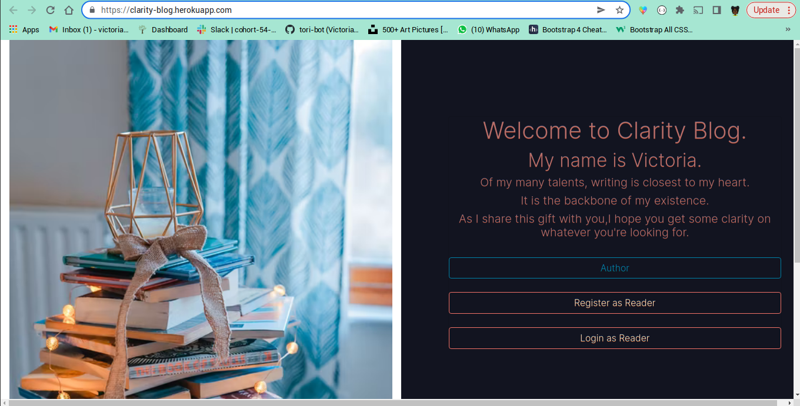
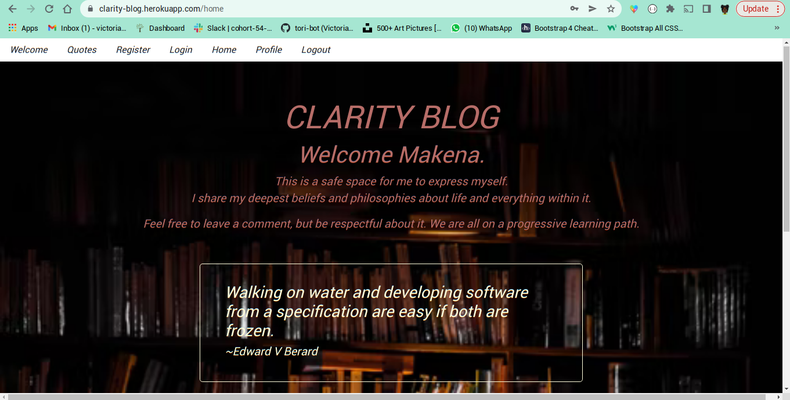

# clarity-blog
An application that provides a space for a user to get creative and express themselves through writing.

# Author: Victoria Makena

Live link:https://clarity-blog.herokuapp.com/

# Features
* A register and login feature for security purposes.
* blogs are saved in a database for future reference.
* Reader can comment on the blogs.
* Reader can curate their own profile.

# Behaviour Driven Development
### BEHAVIOUR
The page loads up and gives reader or author options to either login or register an account.
### INPUT
* User fills register form
* User fills login form
* Author fills blog form
* User fills form to update their profile
### OUTPUT
* User is registered into the application
* User is verified and logged into application
* Author's blog is added to database and is displayed on index page

# Setup Instruction
PLease ignore <> when typing commands.

* Clone this repository
* On your terminal type the command: git clone <repo link>
* The project folder is cloned to your local machine
* Activate the virtual environment using command: source blog/bin/activate
* Install all requirements for the project using the command: pip install -r requirements.txt
* Activate the manage file using command: chmod a+x start.sh
* Run the project on localhost using command: ./start.sh

# Technologies used
Python 3.9.7
Flask 1.1.4
HTML/CSS
Postgresql
SqlAlchemy

For more info on this check the requirements.txt file

# License
Copyright (c) 2022 MIT License. [View License Here](LICENSE)

# Contact Information
Email: makenavictoria1@gmail.com
